# 8-Bit BCD Adder/Subtractor — 두 자리 BCD 가감산기

> 디지털 회로 실험 및 설계 수업 Term Project · **2025.04 – 2025.06** · 5인 팀 (팀장)

## 프로젝트 개요

| | |
|---|---|
| **소개** | 74 시리즈 TTL IC만으로 만든 **두 자리 BCD(00–99) 가감산기**. DIP 스위치로 두 수를 넣고 토글 스위치로 가산/감산을 고르면 결과가 7-세그먼트 2자리에 10진수로 표시됩니다. Multisim 시뮬레이션 → 브레드보드 → 만능기판 납땜 → 3D 프린팅 케이스까지 완성했습니다. |
| **기획 의도** | 일반 이진 연산기는 결과를 사람이 읽으려면 변환이 한 번 더 필요하지만, BCD 연산기는 입출력이 모두 10진수라 계산기처럼 직관적으로 쓸 수 있습니다. 한 자리를 넘어 **두 자리 수의 자리 올림(carry)·자리 내림(borrow)과 BCD 보정**까지 다뤄, 기본 논리 블록(가산기·보수기·보정기)을 조합한 시스템 수준 설계를 경험하는 것이 목표였습니다. |
| **내 역할** | **팀장** — 일정·역할 분담, Multisim 회로 설계·시뮬레이션, 부품 선정·구매, 브레드보드 구성, 만능기판 납땜 및 디버깅 |
| **기여도** | **60%** — 회로 설계부터 실물 제작·디버깅까지 하드웨어 전 과정을 주도 (자료조사·보고서·PPT·케이스 3D 모델링은 팀원 담당) |

## 주요 사양

| 항목 | 내용 |
|---|---|
| 입력 | DIP 스위치 A, B (각 8비트 = BCD 2자리), 1 kΩ 풀업 |
| 출력 | 7-세그먼트 2자리 (십의 자리 / 일의 자리), 감산 모드 표시 LED |
| 연산 | 74LS83 ×2 직렬 8비트 이진 가감산 + BCD 보정 (74LS83 ×3, 74LS08/32, 74LS153) |
| 감산 방식 | 74LS86 XOR로 1의 보수 + Cin = 1 → **2의 보수 덧셈** |
| 사용 IC | 74LS83 ×5, 74LS86 ×2, 74LS08, 74LS32, 74LS153, 74LS47 ×2 (총 12개) |
| 전원 | DC 잭 + 5 V 어댑터 |
| 검증 | 시뮬레이션 6 + 12 = 18, 14 − 8 = 6 / 실물 5 + 8 = 13, 12 − 4 = 8 |

<p align="center">
  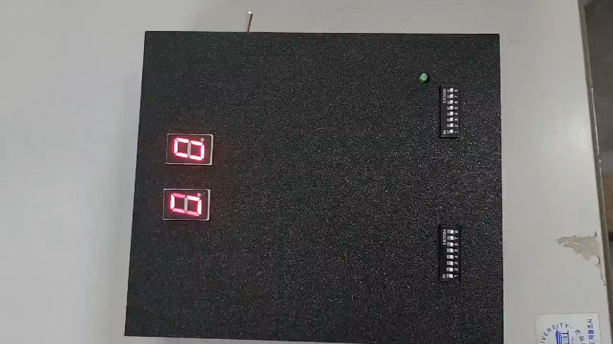
  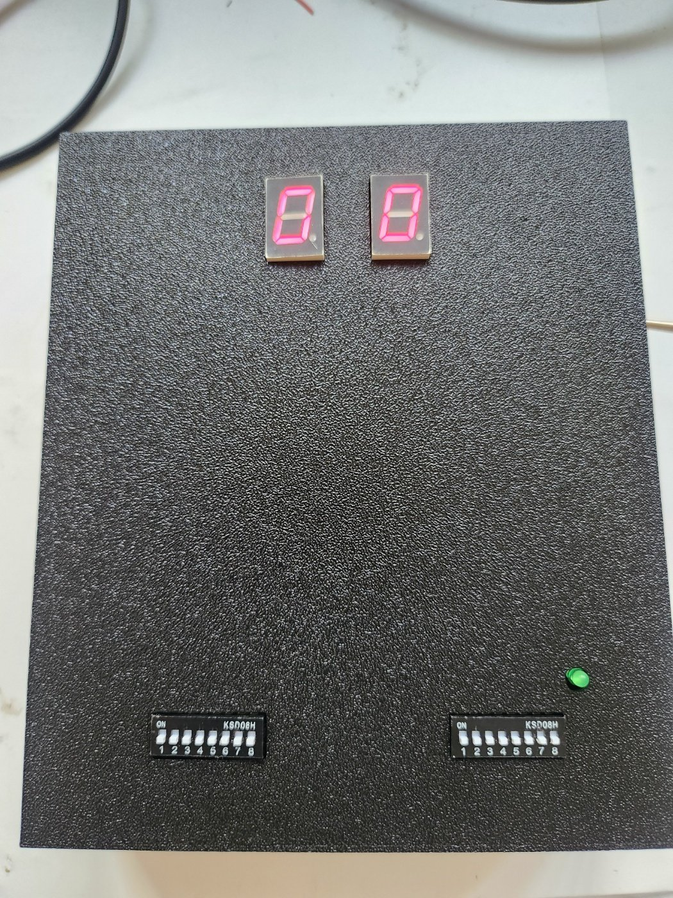
  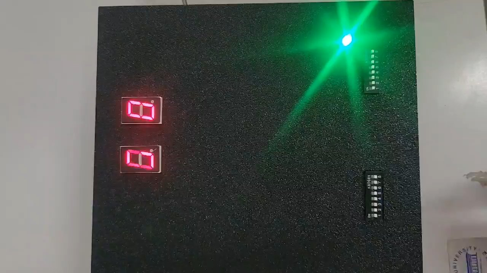
  <br><sub>왼쪽 가산 모드 (LED OFF) · 가운데 완성품 · 오른쪽 감산 모드 (LED ON)</sub>
</p>

---

## 시스템 구조

<p align="center">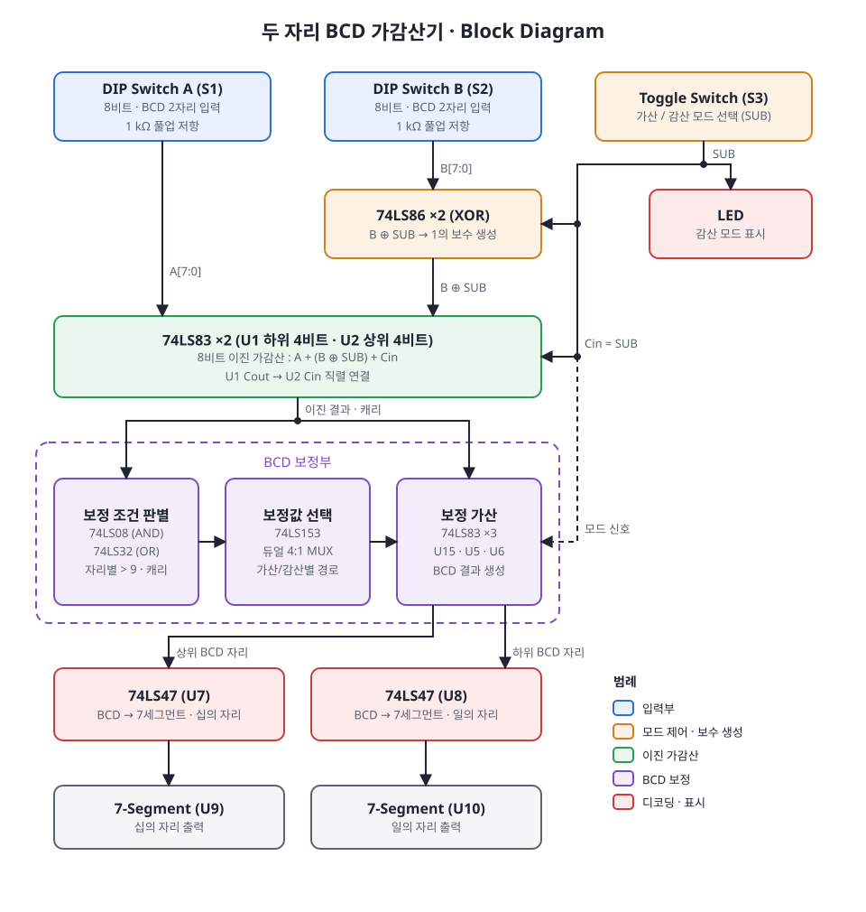</p>

### 동작 원리

**감산 (2의 보수)**: `A − B = A + (~B + 1)`

| SUB | B ⊕ SUB | Cin | 연산 |
|:---:|:---:|:---:|---|
| 0 | B | 0 | A + B |
| 1 | ~B (1의 보수) | 1 | A + ~B + 1 = A − B |

- B의 각 비트를 SUB 신호와 XOR하면 감산 모드에서만 비트가 반전되고, 같은 SUB 신호를 Cin에 넣어 +1을 처리합니다.
- 74LS83은 4비트 가산기라서 두 개를 직렬로 연결(U1 Cout → U2 Cin)해 8비트 연산을 합니다.
- 이진 결과는 자리별로 9를 넘거나 캐리가 생기면 BCD 보정부에서 보정값을 더해 올바른 BCD로 바꾼 뒤 74LS47로 디코딩합니다.

### 제어 흐름

<p align="center">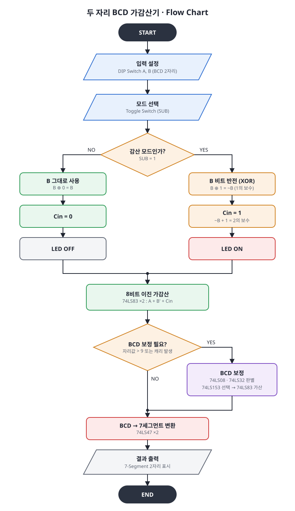</p>

---

## 폴더 구조

```
8bit-bcd-adder-subtractor/
├─ circuit/
│  └─ bcd_adder_subtractor_final.ms14   최종 회로 (NI Multisim 14)
├─ docs/                                 블록도 · 플로우차트 (SVG / PNG)
├─ images/                               회로도, 시뮬레이션, 브레드보드, 3D, 완성품 사진
└─ videos/                               동작 영상
```

---

## 하드웨어

### 회로도

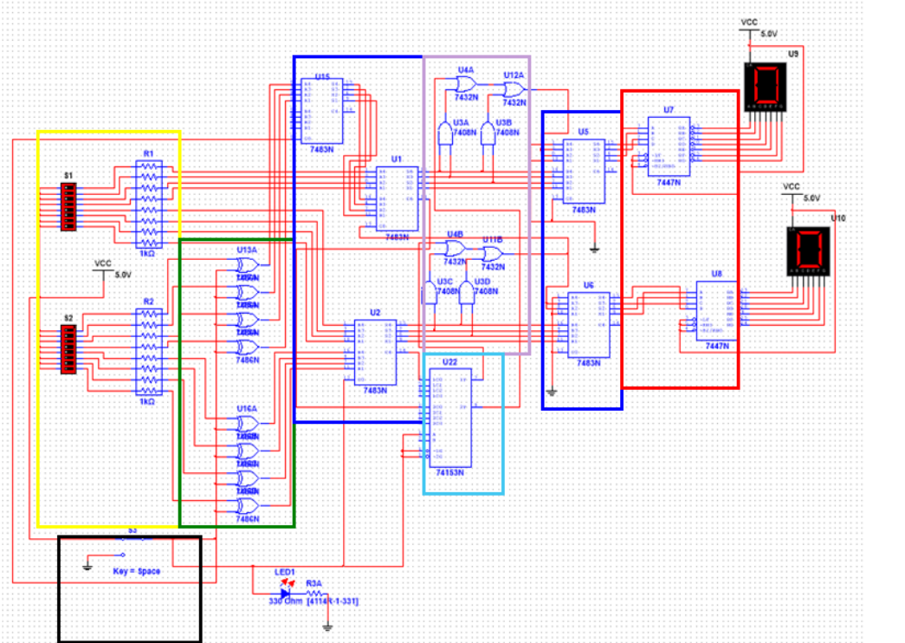

| 색 | 블록 | 구성 |
|---|---|---|
| 🟨 노랑 | 입력 제어부 | DIP 스위치 S1(A), S2(B) + 1 kΩ 풀업 저항 |
| ⬛ 검정 | 가감산 선택 | 토글 스위치 S3 (SUB 신호) |
| 🟩 초록 | 보수 연산 및 제어 | 74LS86 ×2 — B ⊕ SUB |
| 🟦 파랑 | 4비트 가산기 | 74LS83 — U1(하위)·U2(상위) 이진 가감산, U15·U5·U6 보정 가산 |
| 🟪 보라 | 조합 논리 회로 | 74LS08 · 74LS32 — 보정 조건(자리값 > 9, 캐리) 판별 |
| 🩵 하늘 | 멀티플렉서 | 74LS153 — 가산/감산 모드에 따른 보정 경로 선택 |
| 🟥 빨강 | BCD → 7세그먼트 디코더 | 74LS47 ×2 |

### 부품

| 부품 | 용도 | 수량 |
|---|---|:---:|
| 74LS83 | 4비트 이진 가산기 | 5 |
| 74LS86 | XOR 게이트 (보수 생성) | 2 |
| 74LS08 / 74LS32 | AND / OR 게이트 (보정 조건) | 1 / 1 |
| 74LS153 | 듀얼 4:1 멀티플렉서 | 1 |
| 74LS47 | BCD → 7세그먼트 디코더 | 2 |
| 7-Segment (Common Anode) | 결과 2자리 표시 | 2 |
| DIP 스위치 (8핀) / 토글 스위치 | A, B 입력 / 가산·감산 선택 | 2 / 1 |
| LED | 감산 모드 표시 | 1 |
| 저항 1 kΩ / 330 Ω | 스위치 풀업 / LED 전류 제한 | 16 / 1 |
| IC 소켓 14핀 / 16핀 | IC 장착 | 3 / 4 |
| DC 잭 + 5 V 어댑터 | 전원 | 1 |

### 제작 과정

| 브레드보드 | 만능기판 납땜 | 케이스 3D 모델 (윗면 / 바닥면) |
|:---:|:---:|:---:|
| 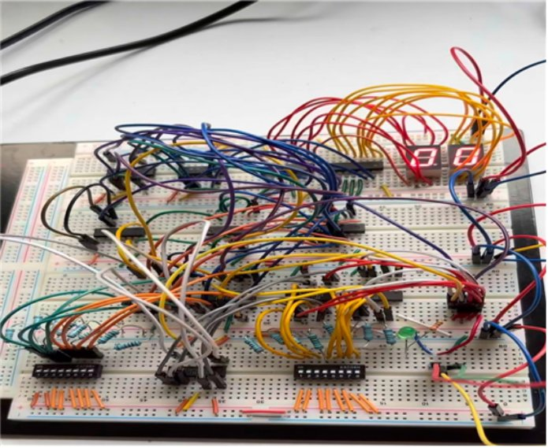 | 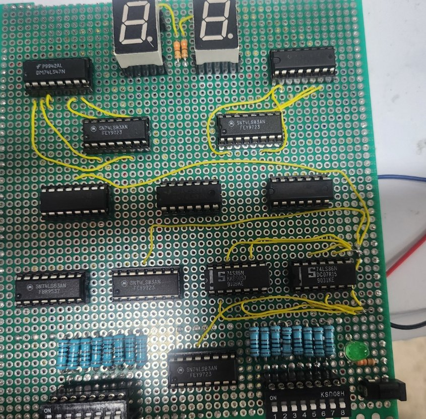 | 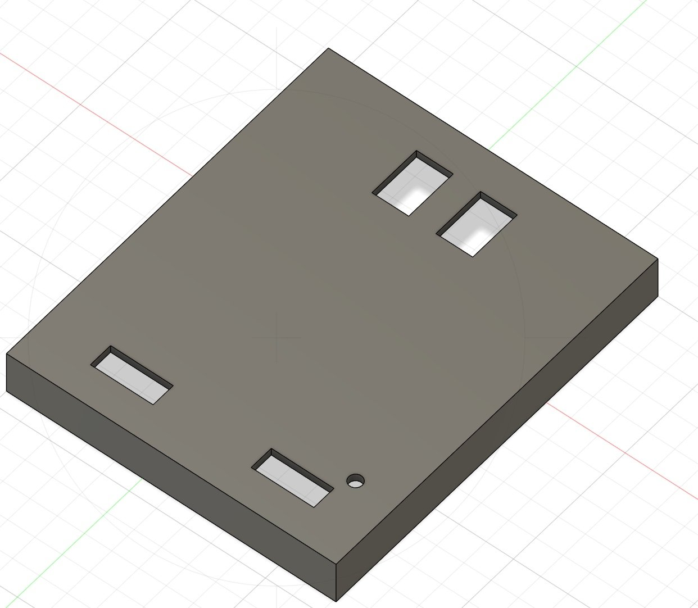 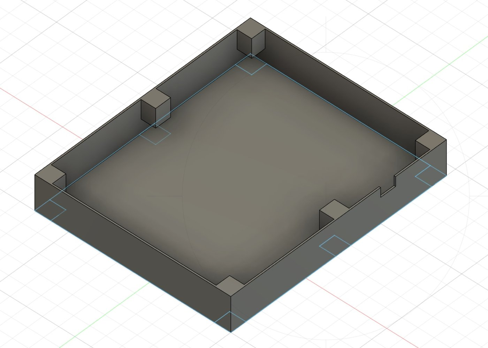 |

- 계산기처럼 작게 만들기 위해 만능기판 한 장에 IC 12개를 촘촘히 배치하고 직접 배선
- 3D 프린팅 케이스 윗면에 7-세그먼트, DIP 스위치, LED 구멍을 내서 조작부만 노출

---

## 결과

| | 가산 | 감산 |
|---|:---:|:---:|
| **시뮬레이션** | 6 + 12 = **18**<br>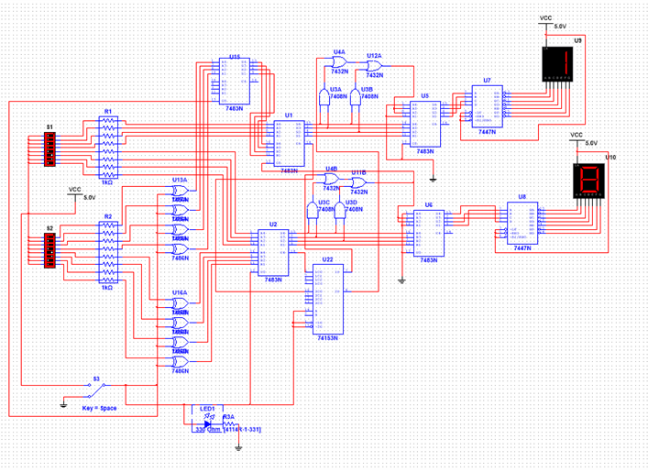 | 14 − 8 = **6**<br>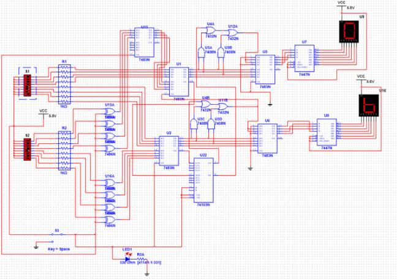 |
| **브레드보드** | 5 + 8 = **13**<br>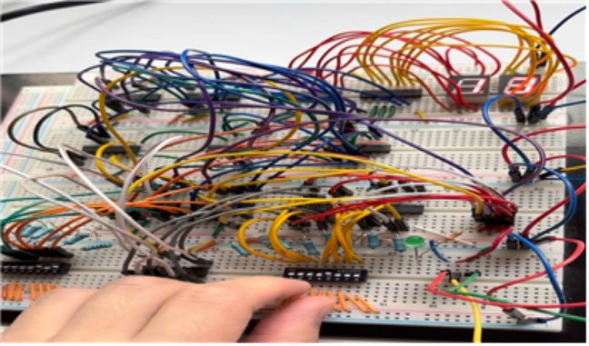 | 12 − 4 = **8**<br>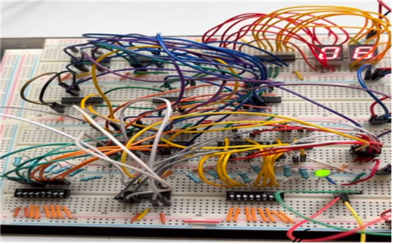 |

동작 영상: [`videos/demo_1.mp4`](videos/demo_1.mp4), [`videos/demo_2.mp4`](videos/demo_2.mp4)

---

## 내 담당 범위

5인 팀 프로젝트에서 팀장으로 제가 담당한 부분입니다.

| 파트 | 내용 |
|---|---|
| 프로젝트 관리 | 역할 분담, 일정 관리 (자료조사 → 이론 → 부품 구매 → 시뮬레이션 → 구현 → 납땜) |
| 시뮬레이션 | Multisim 회로 설계 및 가감산·BCD 보정 동작 검증 |
| 부품 구매 | 부품 선정, 수량 산정, 주문 |
| 하드웨어 | 브레드보드 회로 구성, 만능기판 납땜 및 디버깅 |

---

## 트러블슈팅

### 1. 스위치 입력 플로팅
- **증상**: 브레드보드에서 DIP 스위치를 OFF로 둔 비트가 HIGH/LOW를 오가며 결과가 불안정
- **원인**: 스위치가 열렸을 때 TTL 입력이 어디에도 연결되지 않은 플로팅 상태
- **해결**: 스위치 출력단마다 1 kΩ 풀업 저항(총 16개)을 달아 기본값을 고정

### 2. 시뮬레이션과 실물 동작 차이
- **증상**: 7개 IC로 구성해 Multisim에서는 정상 동작한 회로가, 납땜 후에는 다르게 동작
- **원인**: 시뮬레이션에 없는 전기적 특성과 배선·납땜 상태 문제
- **해결**: 회로를 재구성하고 선 연결을 하나씩 다시 점검

### 3. 십의 자리가 바뀌는 연산에서 출력 오류
- **증상**: `15 − 8`처럼 결과의 십의 자리가 바뀌는 경우 세그먼트에 잘못된 값 표시
- **원인**: 자리 올림/내림이 생길 때의 보정 로직 누락
- **해결**: 캐리 처리 로직을 수정하고 회로 연결을 보완

### 4. 고밀도 배치로 인한 배선·합선 문제 (개선 과제)
- **증상**: IC를 최대한 가깝게 붙여 배치하다 보니 배선 정리가 어렵고 합선 디버깅에 시간이 많이 듦
- **개선 방향**: 만능기판 대신 KiCad로 PCB를 직접 설계 → 다음 프로젝트([ATmega128 POV Display](https://github.com/qetad13/atmega128-pov-display))에서 KiCad PCB로 적용

---

## 실행 방법

### 1. 시뮬레이션
- NI Multisim 14 이상에서 `circuit/bcd_adder_subtractor_final.ms14` 열기 → 시뮬레이션 실행
- S1(A), S2(B) DIP 스위치로 값 입력, **Space** 키로 S3 토글(가산/감산 전환)

### 2. 실물 조작
- 5 V 어댑터 연결 → DIP 스위치로 A, B를 BCD로 입력 → 토글 스위치로 모드 선택 (감산이면 LED 점등)

---

## 기술 스택
`NI Multisim 14`

## 라이선스 / 출처
- 회로 설계는 팀에서 직접 작성했으며, 블록도·플로우차트는 결과보고서를 바탕으로 다시 그렸습니다.
- 데이터시트: [74LS83](https://www.alldatasheet.co.kr/datasheet-pdf/view/51091/FAIRCHILD/74LS83.html) · [74LS47](https://www.alldatasheet.co.kr/datasheet-pdf/view/51080/FAIRCHILD/74LS47.html) · [74LS153](https://www.alldatasheet.co.kr/datasheet-pdf/view/27384/TI/74LS153.html)
